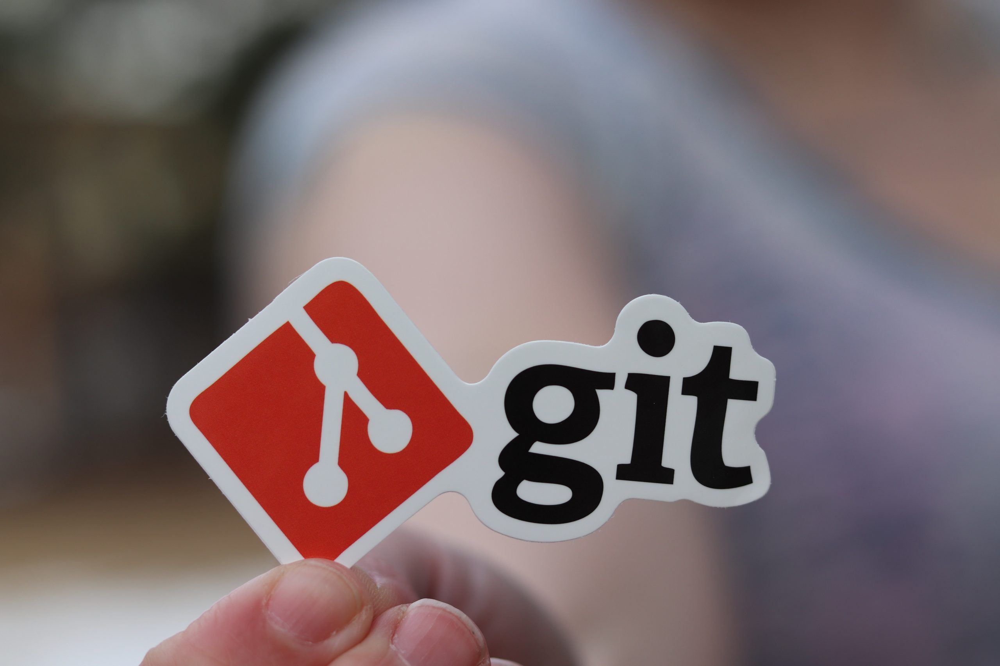

Git is one of the essential tools for any developer, but like all constantly evolving software, its commands and best practices also change over time. In this article, we'll explore why you should consider stopping using `git checkout` and instead adopt the `git switch` and `git restore` commands. We will base our argument on Unix philosophy and the official Git documentation.

## A look back: What was development like before Git?

I wasn't there, but I investigated and was able to ask colleagues with more expertise and experience than me. Before Git became the de facto standard for version control, developers used *Centralized Version Control Systems* like **Concurrent Version System** (CVS), **Subversion** (SVN), and others. Although these systems helped manage collaborative projects, they had significant limitations:

1. **Slow performance**: Operations like creating branches or performing merges were slow and often inefficient.
2. **Dependency on a central server**: Most of these systems were centralized, making offline work difficult or impossible.
3. **Complex conflicts**: Resolving code conflicts was tedious and error-prone.

The origins of Git come from the **Linux Kernel project**, one of the largest and most complex open-source projects that exist. During the early years of its development the Linux Kernel was managed using a proprietary version control system called **BitKeeper**. BitKeeper is a *distributed version control system* (DVCS), which addressed many of the limitations of Centralized Version Control Systems such as CVS and SVN. BitKeeper allowed developers to have their own copy of the entire project history, allowing for offline work and faster performance.

While BitKeeper initially worked well, in 2005, BitMover, the company behind BitKeeper, withdrew the free license for open-source developers, leaving the Linux community without a version control system.

The need arose for a new version control system, so **Linus Torvalds**, the creator of Linux, decided to create one of his own. His goals were clear:

- **Speed**: The system must be fast and efficient, to be able to handle the large volume of contributions to the Linux Kernel.
- **Distributed**: Like BitKeeper, the new system should allow developers to work independently, with their own copy of the repository.
- **Strong Branching and Merging**: Linus emphasized that the new system should handle complex branching and merging scenarios without problems.
- **Open-Source**: The new system must be free and open-source, ensuring that it can be widely adopted by the community.

In just weeks, Torvalds and a small group of developers created the first version of Git. It was released in April 2005 and within months, Git became the main version control system for the Linux kernel.

Since then, **Git has revolutionized the way teams work on software projects**, enabling more agile, secure, and collaborative workflows.